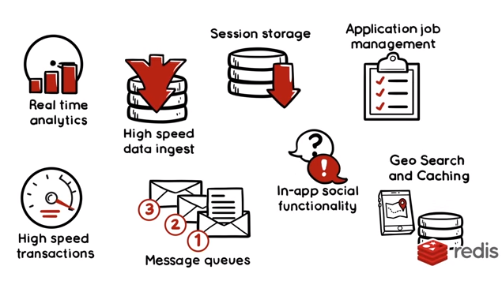
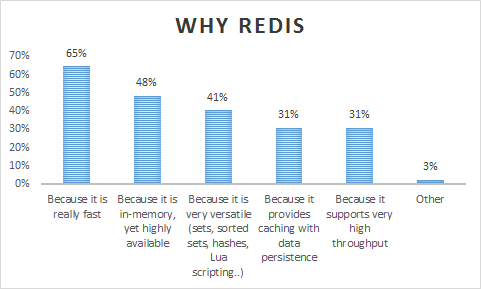
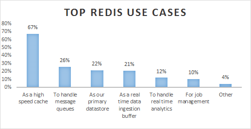
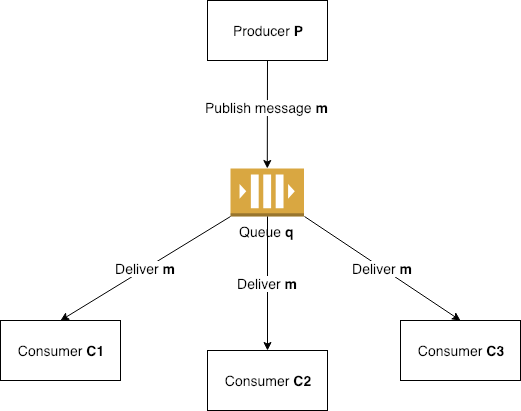
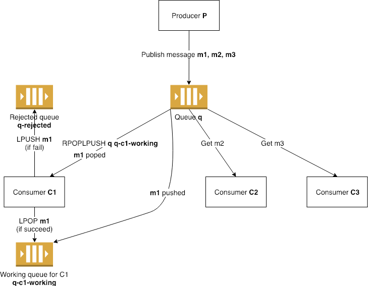

# What is redis?

* In-memory data structure store, used as a database, cache and message broker.
* Key / value database.
* Different levels of on-disk persistence.



# Why redis?

* Not just a cache.
* Multiple datatypes.
* Pub-sub model.
* Cluster mode for high availability.
* Perfectly works in cloud: AWS Elasticache, Azure Redis Cache and Memorystore (Google Cloud).





# Data types

Remember you need in our local:
 
```bash
# redis
# redis-cli 
# npm / nodejs

# install dependencies
npm install
```
## Overview

> * Redis instance has 16 databases, DONT NEED PREFIX IN KEYS

``` bash
redis-cli -n {database_number}
```

>* Debugging from cli

```bash
redis-cli monitor
``` 

> * Main commands: KEYS / DEBUG / SCAN / TYPE / EXPIRATE

## String
> * Basic data type
> * Main commands: set / get

```bash
node examples/datatypes/string.js
``` 

## List
> * Arrays of strings
> * Main commands : lpush / lrange / lpop

```bash
node examples/datatypes/list.js
```

### Set
> * Unique and unordered collection of strings
> * Main commands: sadd / smember / srem / sscan

```bash 
node examples/datatypes/set.js
```

### Hash
> * Maps between string fields and string values
> * Perfect data type to represent objects
> * Main commands: hset / hmset / hget / hgetall / hscan

```bash 
node examples/datatypes/hash.js
```

### Sorted Sets
> * Similarly to Redis Sets, non repeating collections of Strings.
> * Every member of a Sorted Set is associated with score
> * Main commands: zadd / zrangebyscore

```bash 
node examples/datatypes/sorted-set.js
```

### Streams
> * New data type from Redis 5
> * Goal handle large amount of data (example: chat history, logs, etc)
> * Main commands: xadd / xread 

```bash 
node examples/datatypes/stream.js
```

# Transactions

### COMMANDS MULTI, EXEC, DISCARD and WATCH
> * They allow the execution of a group of commands in a single step
> * All the commands in a transaction are serialized and executed sequentially.
> * Atomicity (either all occur or nothing occurs)

```bash 
node examples/transactions/multi-exec.js
```


### LUA SCRIPT

> * You can encapsulate some complex operations in a script and your data layer will perform the atomic

```bash 
node examples/transactions/rewards.js
node examples/transactions/lua-script.js
```

# Message Queues

* PUBLISH / SUBSCRIBE




pros
> * Memory efficiency 
> * Group messagingsS
> * Examples: notifications, chats, etc.


cons
> * High chance loss message

```bash
node pubsub.js
```

* BRPOPLPUSH / RedisSMQ




> * Message only will be consumed by one consumer
> * Less memory efficiency

```bash
node examples/queues/create.js
node examples/queues/producer.js
node examples/queues/consumer.js
```

# Everyone should read

[https://redis.io/topics/introduction](https://redis.io/topics/introduction)

[https://dzone.com/articles/how-redis-is-used-in-practice](https://dzone.com/articles/how-redis-is-used-in-practice)

[https://www.bogotobogo.com/DevOps/Redis/Redis_vs_Memcached.php](https://www.bogotobogo.com/DevOps/Redis/Redis_vs_Memcached.php)

[https://matt.sh/what-is-redis](https://matt.sh/what-is-redis)

[https://matt.sh/introduction-to-redis-data-types](https://matt.sh/introduction-to-redis-data-types)

[https://www.compose.com/articles/a-quick-guide-to-redis-lua-scripting/](https://www.compose.com/articles/a-quick-guide-to-redis-lua-scripting/)

[https://medium.com/@anvannguyen/redis-message-queue-rpoplpush-vs-pub-sub-e8a19a3c071b](https://medium.com/@anvannguyen/redis-message-queue-rpoplpush-vs-pub-sub-e8a19a3c071b)

